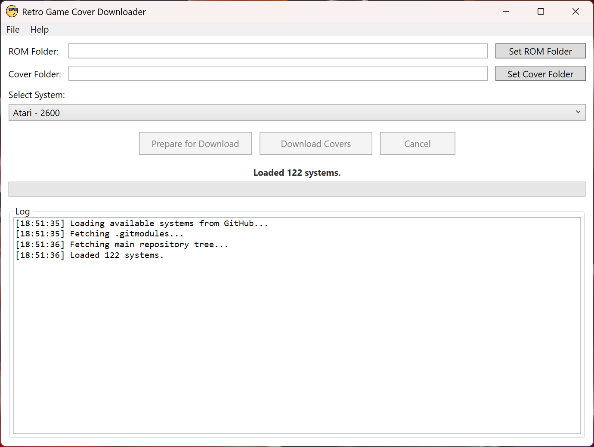
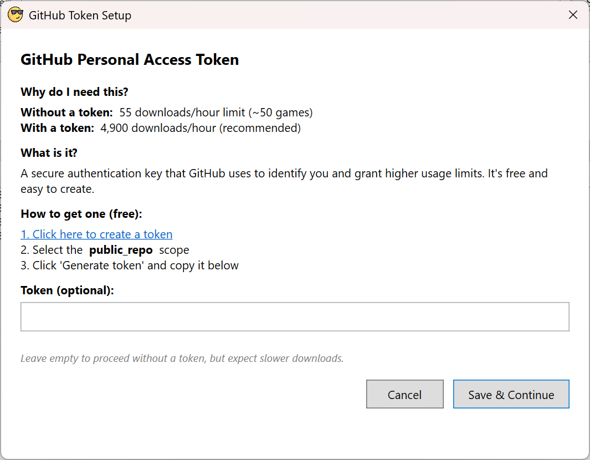

# 🎮 Retro Game Cover Downloader

[](https://dotnet.microsoft.com/)
[](https://docs.microsoft.com/en-us/dotnet/desktop/wpf/)
[](https://docs.github.com/en/rest)

A sleek, modern WPF application that automatically downloads missing cover art for your retro game ROM collection from the official [libretro-thumbnails](https://github.com/libretro-thumbnails) GitHub repositories.

## 📖 Overview

Tired of manually hunting for game cover art? **Retro Game Cover Downloader** scans your ROM folders, identifies missing covers, and fetches them directly from libretro's extensive thumbnail database. With built-in rate limit handling, progress tracking, and error reporting, managing your retro gaming library has never been easier!

## ✨ Features

🎮 **Multi-System Support** - Automatically detects available gaming systems from libretro's repositories  
📁 **Smart Folder Scanning** - Scans your ROMs and existing covers to find what's missing  
⬇️ **Batch Downloading** - Downloads all missing covers in one click with progress tracking  
⚡ **Rate Limit Management** - Intelligent handling of GitHub API limits with visual countdown timer  
🔐 **Token Integration** - Optional GitHub token support for 4,900 downloads/hour (vs 55 without)  
🔄 **Update Checker** - Automatically notifies you of new versions  
🐛 **Error Reporting** - Automatic bug reports to help improve the application  
⏹️ **Cancellation Support** - Cancel operations anytime  
📊 **Progress UI** - Real-time progress bar and status messages  
🖥️ **CLI Support** - Command-line arguments for automation  
🌐 **Proxy Support** - Configure HTTP proxy with host, port, and authenticated credentials  
📂 **File Extensions Configuration** - Customize which file extensions are recognized as ROM files  
🔒 **Settings Encryption** - Tokens and passwords are encrypted using Windows DPAPI  
🔁 **Retry with Exponential Backoff** - Automatic retry on transient failures with intelligent backoff  
⚡ **Circuit Breaker** - Protects against hammering distressed servers during outages  
💾 **Systems Cache** - Caches the available systems list for faster startup and offline resilience

## 🖼️ Screenshots




## 📦 Installation

### Prerequisites
- Windows 10 or later
- .NET 10.0 Runtime (installed automatically with the application)

### Download
1. Grab the latest release from the [Releases Page](https://github.com/drpetersonfernandes/RetroGameCoverDownloader/releases)
2. Extract the ZIP file to your desired location
3. Run `RetroGameCoverDownloader.exe`

## 🔧 Configuration

### GitHub Token (Recommended)
To unlock the full 4,900 downloads/hour limit:

1. Go to **File → GitHub Token** in the menu bar (the token dialog also appears automatically on first launch)
2. Follow the in-app instructions or:
    - Visit [GitHub Token Settings](https://github.com/settings/tokens/new)
    - Generate a token with **`public_repo`** scope
    - Copy and paste it into the application

> **💡 Tip**: Without a token, you're limited to ~55 covers/hour. With a token, you can download thousands!

## 🚀 Usage

### GUI Mode
1. **Set ROM Folder**: Browse to your ROM collection directory
2. **Set Cover Folder**: Choose where to save cover images
3. **Select System**: Pick your gaming system (NES, SNES, Genesis, etc.)
4. **Prepare**: Scan and identify missing covers
5. **Download**: Fetch all missing covers automatically

### Command-Line Mode
```bash
# Basic usage (ROM folder first, then Cover folder)
RetroGameCoverDownloader.exe "C:\ROMs\SNES" "C:\Covers\SNES"

# With flags
RetroGameCoverDownloader.exe --cover "C:\Covers" --rom "C:\ROMs"

# Positional arguments (ROM folder first, then Cover folder)
RetroGameCoverDownloader.exe "C:\ROMs" "C:\Covers"
```

## 🛠️ Technical Details

### Architecture
- **MVVM Pattern**: Main window uses ViewModels; dialogs use code-behind for simplicity
- **Async/Await**: Fully asynchronous operations for UI responsiveness
- **Rate Limiting**: Custom `RateLimiter` service with event notifications
- **Error Handling**: Comprehensive logging and bug reporting
- **Circuit Breaker**: Tracks consecutive 503 errors and triggers cooldown to avoid hammering distressed servers
- **Retry Logic**: Exponential backoff with configurable retry attempts

### Key Components
- `MainViewModel`: Core business logic and state management
- `GitHubService`: Handles all GitHub API interactions
- `BugReportService`: Automatic error reporting to developer
- `SettingsManager`: XML-based settings persistence with DPAPI encryption for sensitive data
- `RateLimiter`: Intelligent API request throttling
- `UpdateCheckerService`: Checks for new application versions

### Testing
The project includes a comprehensive test suite using **xunit**:

```bash
dotnet test
```

Tests cover models, services, helpers, converters, commands, ViewModels, managers, and integration tests. A `MockBugReportService` is injected via `[ModuleInitializer]` to prevent real API calls during testing.

## 📄 License

This project is licensed under the **GPL-3.0 license**.

## 🆘 Support

- **Issues**: [Report Bugs](https://github.com/drpetersonfernandes/RetroGameCoverDownloader/issues)
- **Discussions**: [Ask Questions](https://github.com/drpetersonfernandes/RetroGameCoverDownloader/discussions)
- **Email**: support@purelogiccode.com

## ⭐ Show Your Support

If you find this project helpful, please consider giving it a **star** on GitHub! It helps others discover the project and motivates continued development.

[](https://github.com/drpetersonfernandes/RetroGameCoverDownloader)

**⭐ Click the star button at the top of the repository if you like this project! ⭐**

---

<div align="center">
Made with ❤️ by <a href="https://www.purelogiccode.com">Pure Logic Code</a>
</div>